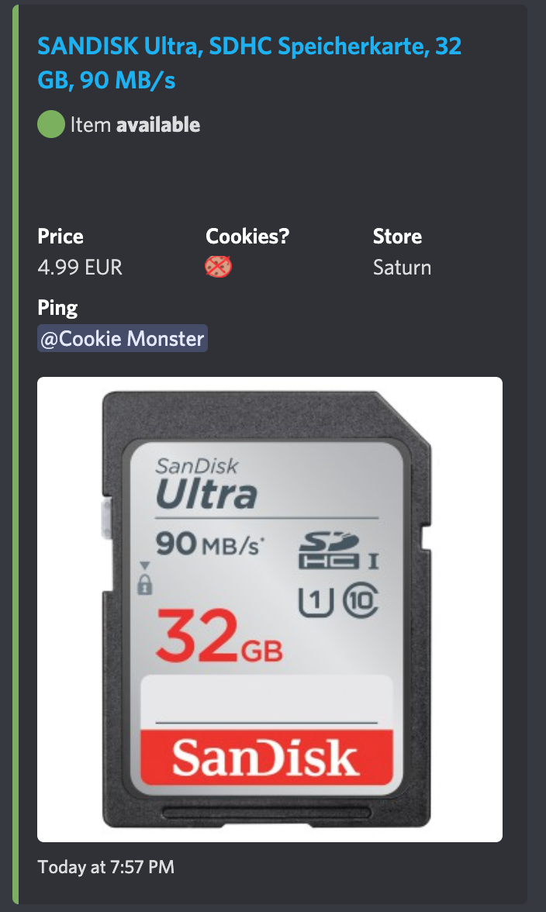

# stockshock

> Your friendly 🤖 to check the wishlist and categories of MediaMarkt and Saturn for available items

## No support 🚨

Sadly, I can't offer any support to help you get the bot up and running.  
You need to figure the things out on your own.  
**However**, if you believe you found an actual bug, please open an issue.

## Prerequisites

You need to put items on your wishlist in order to have this bot working.

### Supported stores

-   MediaMarkt Austria
-   MediaMarkt Germany
-   MediaMarkt Spain
-   Saturn

## Installation

Install Node.js v14 or higher.  
Download or clone the project then run:

```sh
npm install
```

## Configuration & Usage

Copy the `stores_example.toml` to `stores.toml` and configure your credentials.  
**You need to supply the query hashes from the MM/S API as they change too often to maintain!**

You can setup different categories (use the ID) to check, too.  
If desired, configure the webhook URL(s), websocket announcements or proxies.

### Discord notifications

Discord can be used to send rich notifications to your server. You need to create a bot and have the bot credentials at hand.  
Here is an example how the message looks like:



## Run the bot

Run

```sh
npm start
```

and follow the terminal instructions.  
Happy hunting! 🏹⚡️

### Turn off headless mode

Per default the Chromium behind the scenes is run in headless mode. If the login fails due to CloudFlare or MM/S bot protection, please launch it as

```sh
npm start -- --headless false
```

Do **not** close the browser window. You can minimize it though.

### Pass in a store via CLI

You can launch the bot directly with a store by supplying the store as an argument

```sh
npm start -- --store <mmat|mmde|mmes|saturn>
```

### Docker

You can use the provided Docker image (https://hub.docker.com/r/timbru31/mms-stockshock), too.
An example launch command would be:

```sh
docker run --restart on-failure --memory 500m --memory-swap 500m -v $PWD/stores.toml:/opt/mms-stockshock/stores.toml -e "STORE=mmde" -d timbru31/mms-stockshock
```

---

Built by (c) Tim Brust and contributors. Released under the GPL v3 license.
